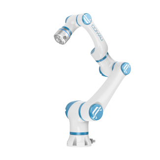

Myco Robot
======


<p align="center">
  
</p>

This repository provides ROS2 support for the Myco Robot. The recommend operating environment is on Ubuntu 20.04 with ROS humble. So far These packages haven't been tested in other environment.

### Installation

#### Ubuntu 20.04 + ROS Humble

**Install some important dependent software packages:**
```sh
$ sudo apt-get install ros-humble-joint-trajectory-controller
$ sudo apt-get install ros-humble-controller-manager
$ sudo apt-get install ros-humble-trajectory-msgs
$ sudo apt-get install ros-humble-gazebo-ros2-control*
$ sudo apt-get install ros-humble-joint-state-controller
$ sudo apt-get install ros-humble-position-controllers
```

**Install related software packages:**
```sh
$ sudo apt-get install build-essential libgtk-3-dev
$ sudo pip3 install wxpython
$ sudo pip3 install transforms3d
```

**Install or upgrade MoveIt!.** 

If you have installed MoveIt!, please make sure that it's been upgraded to the latest version.

Install/Upgrade MoveIt!:

```sh
$ sudo apt-get update
$ sudo apt-get install ros-humble-moveit
```


**Install this repository from Source**

First set up a catkin workspace (see [this tutorials](http://wiki.ros.org/catkin/Tutorials)).  
Then clone the repository into the src/ folder. It should look like /path/to/your/catkin_workspace/src/myco_robot.  
Make sure to source the correct setup file according to your workspace hierarchy, then use catkin_make to compile.  

Assuming your catkin workspace folder is ~/catkin_ws, you should use the following commands:
```sh
$ cd ~/catkin_ws/src
$ git clone https://github.com/Comau/MyCo-ROS2.git
$ cd ..
$ colcon build
$ source install/setup.bash
```


---

### Usage with Gazebo Simulation

***There are launch files available to bringup a simulated robot - either Myco3, Myco5 or Myco10.  
In the following the commands for Myco3 are given. For Myco5 or Myco10, simply replace the prefix accordingly.***

Bring up the simulated robot in Gazebo and Start up RViz with a configuration including the MoveIt!:
```sh
$ ros2 launch myco_3_5_950mm_ros2_moveit2 myco_3_5_950mm.launch.py
```

Start up myco basic api and "Myco Control Panel" interface:
```sh
$ rros2 launch myco_3_5_950mm_ros2_moveit2 myco_3_5_950mm_basic_api.launch.py 
$ ros2 launch myco_basic_api fake_myco_gui.launch.py
```

> Tutorial about how to use MoveIt! RViz plugin: [docs/moveit_plugin_tutorial_english.md](docs/moveit_plugin_tutorial_english.md)  
Tips:
Every time you want to plan a trajectory, you should set the start state to current first.


---

###  Usage with real Hardware

***There are launch files available to bringup a real robot - either Myco3, Myco5 or Myco10.  
In the following the commands for Myco3 are given. For Myco5 or Myco10, simply replace the prefix accordingly.***

Put the file *myco_drivers.yaml*, that you got from the vendor, into the folder myco_robot_bringup/config/.Then copy the parameters in this file to the myco_robot_bringup/config/myco_arm_control.yaml

Connect Myco to the computer with a LAN cable. Then confirm the ethernet interface name of the connection with `ifconfig`. The default ethernet name is eth0. If the ethernet name is not eth0, you should correct the following line in the file *myco_robot_bringup/config/myco_arm_control.yaml* 

```
myco_ethernet_name: eth0
```

Bring up the hardware of Myco. Before bringing up the hardware, you should setup Linux with PREEMPT_RT properly. There is a [tutorial](https://wiki.linuxfoundation.org/realtime/documentation/howto/applications/preemptrt_setup). There are two versions of myco EtherCAT slaves. Please bring up the hardware accordingly.

```sh
$ sudo chrt 10 bash
$ ros2 launch myco_3_5_950mm_ros2_moveit2 myco_3_5_950mm_moveit.launch.py 
```

Start up RViz with a configuration including the MoveIt! Motion Planning plugin:
```sh
$ sudo su
$ ros2 launch myco_3_5_950mm_ros2_moveit2 myco_3_5_950mm_moveit_rviz.launch.py
```
Start up myco basic api:
```sh
$ sudo su
$ ros2 launch myco_3_5_950mm_ros2_moveit2 myco_3_5_950mm_basic_api.launch.py
```
Start up "Myco Control Panel" interface:
```sh
$ sudo su
$ ros2 launch myco_basic_api myco_gui.launch.py
```

Enable the servos of Myco with "Myco Control Panel" interface: if there is no "Warning", just press the "Servo On" button to enable the robot. If there is "Warning", press the "Clear Fault" button first and then press the "Servo On" button.

Tutorial about how to use MoveIt! RViz plugin: [docs/moveit_plugin_tutorial_english.md](docs/moveit_plugin_tutorial_english.md)  
Tips:
Every time you want to plan a trajectory, you should set the start state to current first.

Before turning the robot off, you should press the "Servo Off" button to disable the robot.

For more information about API, see [docs/API_description_english.md](docs/API_description_english.md)
